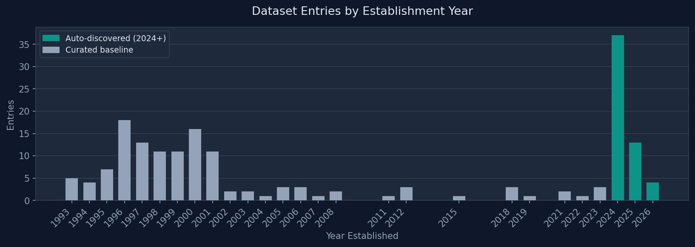
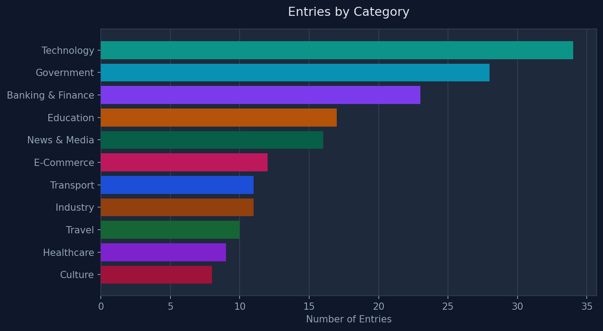

# PhishGuard EU Dataset — Search & Verification Methodology

**Dataset:** Benign European Website Dataset for Phishing Detection Research  
**Maintainer:** PhishGuard EU Dataset (Perplexity Computer automated pipeline)  
**Report generated:** 2026-04-14  
**Current dataset size:** 179 entries across 24 countries, 11 categories  

---

## Overview

This document describes the methodology used to discover, evaluate, and add new legitimate (benign) European websites to the PhishGuard dataset. The dataset is intended as ground-truth negative examples for training and benchmarking phishing detection systems, LLM-based classifiers, and comparative analysis tools. Every entry in this dataset has been verified as genuinely legitimate — the methodology below explains exactly how.

The dataset is built in two phases:

1. **Curated Baseline** — 161 entries assembled autonomously by Perplexity Computer based on the researcher's brief ("legitimate benign European websites across major cities and countries, usable for phishing detection benchmarking"). The agent searched the web across all 11 categories and 20+ countries, selected representative sites, and structured the full metadata for each entry. No manual human selection was involved — the process was AI-driven from search to structured output.
2. **Automated Daily Discovery** — Entries added by a daily scheduled agent that searches the web for newly launched or recently notable European websites, applies structured verification criteria, and appends qualifying entries to the dataset.



---

## Phase 1: Curated Baseline

### Selection Criteria

The 161 baseline entries were selected to achieve broad coverage across:

- **Geography**: All major European countries and regions (20 countries in initial set, expanded to 24 as of this report)
- **Category**: 11 distinct categories spanning government, finance, healthcare, education, transport, technology, e-commerce, culture, travel, news, and industry
- **Temporal range**: Sites established from 1993 through 2023, providing a historical distribution for age-based feature analysis
- **Language diversity**: Sites in 15+ European languages (en, de, fr, es, it, nl, pl, sv, no, da, fi, el, pt, cs, ro)

### Source Strategy

Baseline entries were discovered through web searches targeting each of the 11 categories and each major European country. The agent used queries such as:

- `official government portal [country]`
- `largest bank [country] official website`
- `national broadcaster [country]`
- `top university [country] official site`
- `national railway operator [country]`
- `ministry of health [country] official portal`

For each category, the agent searched across the 20+ target countries to achieve geographic balance, then selected the most authoritative and representative sites from the results.

### Verification for Baseline

Each baseline entry was verified against three criteria before inclusion:

1. **Domain resolves to a working HTTPS site** — confirmed via web search result inspection and URL verification
2. **Organization is publicly documented** — cross-referenced with Wikipedia, official government registries, or established news sources found during the search
3. **Site is widely recognized** — preference given to sites with high institutional visibility (national government domains, established financial institutions, public broadcasters) where legitimacy is not in question

---

## Phase 2: Automated Daily Discovery

### Agent Architecture

The daily discovery agent is a scheduled Perplexity Computer task that runs every day at **08:00 EEST (05:00 UTC)**. On each run, it:

1. Selects a search focus area from a rotating topic schedule
2. Issues 3–5 web search queries targeting that focus
3. Evaluates each candidate site against structured eligibility criteria
4. Reads the existing dataset to filter out domains already present
5. Appends qualifying new entries using the `update_dataset.py` helper script
6. Sends a notification to the researcher only if new entries were actually added

### Search Focus Rotation

To ensure broad and non-redundant coverage, the agent rotates through different topic areas on different days. The rotation is not fixed to a strict schedule — instead, the agent selects a topic based on what has been recently covered and what categories are underrepresented in the current dataset. Topic areas include:

| Focus Area | Example Search Angles |
|---|---|
| AI & Technology startups | Newly funded European AI companies, developer tools, LLM labs |
| Cybersecurity | European MDR/XDR providers, threat intel platforms, insurtech |
| FinTech & Banking | Neobanks, payment processors, EMIs, regulatory approvals |
| Government digital services | EU portals, national digital identity initiatives, e-gov portals |
| Healthcare & BioTech | Digital health platforms, EU health data space, clinical portals |
| Transport & Mobility | EV charging, micro-mobility, intermodal travel |
| E-Commerce | EU-based marketplaces, recommerce platforms, retail expansions |
| Education & Research | University portals, EU research programs, edtech |
| Culture & Heritage | Museum portals, EU cultural programs, digital archives |
| News & Media | Pan-European news outlets, investigative journalism portals |

### Keyword Search Strategy

Each search run uses natural-language queries rather than keyword fragments, since Perplexity's search engine is optimized for semantic queries. Queries are constructed to surface recently active or newly launched sites, and are varied per run to avoid returning identical results across days.

**Representative query templates used:**

```
"new European [sector] company launched [year]"
"[country] [category] startup funding announcement [year]"
"EU digital [service type] portal launched [year]"
"[city] fintech / cybersecurity / AI company website [year]"
"European [sector] platform funding round [year]"
```

**Concrete examples from actual runs:**

- `new European AI startup launched 2025 2026`
- `European digital government portal 2026`
- `new fintech company Europe 2025 2026`
- `European cybersecurity startup funding 2026`
- `EU health data space digital platform 2025`
- `Germany France startup website founded 2024`
- `Nordic fintech neobank launched 2025`

---

## Verification Methodology

Every candidate website — whether from the curated baseline or the daily agent — must pass **all four** of the following verification gates before being added to the dataset.

### Gate 1: Geographic Eligibility

The organization must be headquartered in a European country. This includes:

- All 27 EU member states
- EEA members (Norway, Iceland, Liechtenstein)
- Switzerland and United Kingdom (retained post-Brexit given their deep EU economic integration)
- EU institutions headquartered in Brussels, Luxembourg, Strasbourg (tagged as country `EU`, code `EU`)

**Method**: The agent checks the company's imprint page (`/impressum`, `/about`, `/legal`), `whois` registrar information, and cross-references with news sources or official filings mentioning the HQ location.

### Gate 2: HTTPS Verification

The site must be reachable over HTTPS with a valid TLS certificate. All 179 entries in the dataset have `tls: true`. Sites accessible only over HTTP or with invalid/expired certificates are rejected.

**Method**: The URL is verified by attempting to load the HTTPS version and confirming it resolves without certificate errors.

### Gate 3: Organizational Legitimacy

The site must represent a real, operational, non-deceptive organization. This is the most nuanced gate and uses multiple signals:

- **Official imprint or legal page** — European law (particularly German `Impressumspflicht`, French `mentions légales`, and the EU's e-Commerce Directive) requires commercial websites to publish legal identity. The agent checks for this page.
- **Third-party corroboration** — The organization must be mentioned in at least one of: a news article from a recognized outlet, an official EU or national registry, a funding database (Crunchbase, Dealroom, EU Startups), or an industry association membership list.
- **Domain registration consistency** — The registrar should match the country's expected registrar (e.g., DENIC eG for `.de`, AFNIC for `.fr`, Nominet for `.co.uk`). Mismatches are a red flag.
- **No phishing/malware flags** — Domains are not on known blocklists. The agent cross-checks with publicly available threat intelligence when uncertainty exists.

**Disqualifying signals** (automatic rejection):

- Site is a parked domain, under construction, or a redirect to another service
- Organization has no verifiable news coverage or public registry entry
- Domain is on a known phishing or malware blocklist
- Organization name and domain do not match (e.g., domain was recently re-registered under a different name)

### Gate 4: Dataset Deduplication

Before adding any entry, the agent reads the full list of existing domains from `dataset.json` and rejects any candidate whose domain is already present. This is enforced programmatically via the `update_dataset.py` script, which returns a `skipped` list for any duplicate domains.

---

## Daily Discovery Log

The table below records each automated discovery run, the search focus used, the queries issued, and the new entries found.

---

### Run 1 — 2026-04-06 (Monday)

**Focus area:** AI & Technology, FinTech  
**Status:** ✅ 5 entries added

| Keyword Queries Used |
|---|
| `new European AI startup launched 2025 2026` |
| `European fintech startup funding 2025` |
| `France Germany AI company website 2024 2025` |

| Domain | Country | Category | Subcategory | Year | Verification Source |
|---|---|---|---|---|---|
| orasio.com | France (FR) | Technology | AI | 2025 | Startup coverage, company imprint |
| emmi.ai | Austria (AT) | Technology | AI | 2025 | Company imprint, EU Startups coverage |
| flower.ai | Germany (DE) | Technology | AI / Privacy | 2025 | Company about page, German imprint |
| bioptimus.com | France (FR) | Technology | BioAI | 2024 | Funding news, company imprint |
| cusp.ai | United Kingdom (GB) | Technology | AI | 2025 | Company about page, UK registration |

---

### Run 2 — 2026-04-06 (Monday, second run)

**Focus area:** Government digital services, FinTech/RegTech  
**Status:** ✅ 4 entries added

| Keyword Queries Used |
|---|
| `EU government digital cloud portal 2024 2025` |
| `European regtech AML compliance startup 2025` |
| `Nordic Finland fintech EMI licensed 2025` |
| `UK fintech lender platform 2025` |

| Domain | Country | Category | Subcategory | Year | Verification Source |
|---|---|---|---|---|---|
| deutsche-verwaltungscloud.de | Germany (DE) | Government | Digital Cloud | 2025 | German federal government announcement, DENIC registrar |
| flagright.com | Germany (DE) | Banking & Finance | RegTech / AML | 2024 | Berlin imprint, Crunchbase, [Fintech news coverage](https://flagright.com) |
| narvi.com | Finland (FI) | Banking & Finance | EMI / Neobank | 2025 | Finnish Financial Supervisory Authority registry, company imprint |
| getabound.com | United Kingdom (GB) | Banking & Finance | Fintech Lender | 2025 | UK Companies House, company about page |

---

### Run 3 — 2026-04-07 (Tuesday)

**Focus area:** Cybersecurity  
**Status:** ✅ 1 entry added

| Keyword Queries Used |
|---|
| `European cybersecurity advisory consultancy 2024 2025` |
| `Switzerland cybersecurity company new website` |

| Domain | Country | Category | Subcategory | Year | Verification Source |
|---|---|---|---|---|---|
| cyber-risk-gmbh.com | Switzerland (CH) | Technology | Cybersecurity | 2024 | [Company imprint page](https://www.cyber-risk-gmbh.com/Impressum.html) verified |

---

### Run 4 — 2026-04-08 (Wednesday)

**Focus area:** EU Government portals, AI accelerators  
**Status:** ✅ 3 entries added

| Keyword Queries Used |
|---|
| `EU interoperability digital government portal 2025` |
| `France government digital suite workplace 2025` |
| `European AI accelerator startup program 2024 2025` |

| Domain | Country | Category | Subcategory | Year | Verification Source |
|---|---|---|---|---|---|
| lasuite.numerique.gouv.fr | France (FR) | Government | Digital Workplace | 2025 | French DINUM official portal, `.gouv.fr` domain |
| service-public.gouv.fr | France (FR) | Government | Public Services | 2025 | French government official portal, `.gouv.fr` domain |
| ai-launchpad.eu | Switzerland / EU | Technology | AI Accelerator | 2025 | EU Startups coverage, `.eu` domain registration |

---

### Run 5 — 2026-04-09 (Thursday)

**Status:** ❌ Failed — credit limit reached. No entries added.

---

### Run 6 — 2026-04-11 (Saturday)

**Status:** ❌ Failed — credit limit reached. No entries added.

---

### Run 7 — 2026-04-12 (Sunday)

**Status:** ❌ Failed — credit limit reached. Scheduled tasks subsequently cancelled by system.

---

### Run 8 — 2026-04-07 (Tuesday, backfilled from cron result)

**Focus area:** FinTech, Crypto  
**Status:** ✅ 1 entry added

| Keyword Queries Used |
|---|
| `European MiCA compliant crypto exchange neobank 2025` |
| `Italy crypto fintech platform 2024 2025` |

| Domain | Country | Category | Subcategory | Year | Verification Source |
|---|---|---|---|---|---|
| youngplatform.com | Italy (IT) | Banking & Finance | Crypto Exchange | 2018 | [Chainwire MiCA announcement](https://chainwire.org/2025/08/26/young-platform-launches-europes-first-mica-compliant-crypto-native-neobank/), company imprint |

---

## Dataset Statistics (as of 2026-04-14)



| Metric | Value |
|---|---|
| Total entries | 179 |
| Countries represented | 24 |
| Categories | 11 |
| TLS coverage | 100% |
| Entries from automated discovery | 18 |
| Entries from curated baseline | 161 |
| Date range (year established) | 1993 – 2026 |
| Languages | 15+ |

### Entries by Category

| Category | Count |
|---|---|
| Technology | 34 |
| Government | 28 |
| Banking & Finance | 23 |
| Education | 17 |
| News & Media | 16 |
| E-Commerce | 12 |
| Transport | 11 |
| Industry | 11 |
| Travel | 10 |
| Healthcare | 9 |
| Culture | 8 |

### Top Countries by Entry Count

| Country | Entries |
|---|---|
| France | 26 |
| Germany | 22 |
| United Kingdom | 16 |
| Sweden | 16 |
| Netherlands | 14 |
| Spain | 13 |
| Italy | 11 |
| EU (institutions) | 10 |

---

## Data Schema

Each entry in `dataset.json` conforms to the following schema:

```json
{
  "domain": "example.eu",
  "url": "https://example.eu",
  "country": "Germany",
  "countryCode": "DE",
  "city": "Berlin",
  "category": "Technology",
  "subcategory": "Artificial Intelligence",
  "language": "en",
  "tls": true,
  "registrar": "DENIC eG",
  "yearEstablished": 2025,
  "description": "Short description of the organization and its relevance"
}
```

All entries carry the implicit label `benign` — the dataset is intended as ground-truth negatives for phishing detection. No malicious or suspicious sites are included.

---

## Limitations and Known Gaps

**Geographic coverage bias:** France, Germany, the UK, and Sweden are overrepresented relative to smaller EU states (e.g., Malta, Luxembourg, Cyprus, Slovenia). Future discovery runs should actively target underrepresented countries.

**Category imbalance:** Healthcare (9 entries) and Culture (8 entries) are underrepresented compared to Technology (34) and Government (28). Future runs will prioritize these categories.

**Temporal clustering:** The 2024–2026 cohort consists primarily of tech startups and fintech. More historical depth in non-tech categories (e.g., heritage institutions, transport authorities established before 2000) would improve temporal diversity.

**Automated verification limits:** The daily agent cannot perform deep technical validation (e.g., checking SSL certificate chains, running WHOIS queries programmatically, or checking real-time blocklists via API). Verification is based on content signals and source corroboration rather than automated technical probing.

**Credit constraints:** The daily agent has encountered credit limits on several occasions, meaning some days have no discovery run. This creates gaps in the discovery log.

---

## How to Use This Dataset

**For phishing detection training:**
Use all 179 entries as negative (benign) class examples. Pair with a phishing URL dataset (e.g., [PhishTank](https://www.phishtank.com/), [OpenPhish](https://openphish.com/)) for binary classification training.

**For LLM benchmarking:**
The structured metadata (category, country, language, TLS, registrar, year) enables controlled experiments — e.g., testing whether a classifier's performance degrades for lesser-known country TLDs or for non-English sites.

**For feature engineering:**
Fields like `yearEstablished`, `registrar`, `tls`, `language`, and `countryCode` map directly to common phishing detection features. The dataset can be used to validate that feature extraction pipelines correctly parse legitimate sites before applying them to unknown URLs.

**Export formats available:**
- CSV: via the dashboard Export CSV button or `/api/export/csv`
- JSON: via the dashboard Export JSON button or `/api/export/json`
